# Credit Card Fraud Detection

This repository contains code for detecting credit card fraud using anomaly detection techniques. Anomaly detection is a technique used to identify unusual patterns that do not conform to expected behavior, called outliers. It has many applications in business, from intrusion detection to system health monitoring, and from fraud detection in credit card transactions to fault detection in operating environments.

## Theoretical Description of Project

In data mining, anomaly detection (also outlier detection) is the identification of rare items, events or observations which raise suspicions by differing significantly from the majority of the data. Anomalies can be broadly categorized as point anomalies, contextual anomalies, or collective anomalies. 

### Point anomalies
A single instance of data is anomalous if it's too far off from the rest. Business use case: Detecting credit card fraud based on "amount spent."

### Contextual anomalies
The abnormality is context-specific. This type of anomaly is common in time-series data. Business use case: Spending $100 on food every day during the holiday season is normal, but may be odd otherwise.

### Collective anomalies
A set of data instances collectively helps in detecting anomalies. Business use case: Someone is trying to copy data from a remote machine to a local host unexpectedly, an anomaly that would be flagged as a potential cyber attack.

Anomaly detection is similar to but not entirely the same as noise removal and novelty detection.

Novelty detection is concerned with identifying an unobserved pattern in new observations not included in training data like a sudden interest in a new channel on YouTube during Christmas, for instance.

Noise removal (NR) is the process of removing noise from an otherwise meaningful signal.

### Anomaly Detection Techniques

#### Simple Statistical Methods
The simplest approach to identifying irregularities in data is to flag the data points that deviate from common statistical properties of a distribution, including mean, median, mode, and quantiles. Let's say the definition of an anomalous data point is one that deviates by a certain standard deviation from the mean. Traversing mean over time-series data isn't exactly trivial, as it's not static. You would need a rolling window to compute the average across the data points. Technically, this is called a rolling average or a moving average, and it's intended to smooth short-term fluctuations and highlight long-term ones. Mathematically, an n-period simple moving average can also be defined as a "low pass filter."

Challenges with Simple Statistical Methods 
The low pass filter allows you to identify anomalies in simple use cases, but there are certain situations where this technique won't work. Here are a few:

- The data contains noise which might be similar to abnormal behavior, because the boundary between normal and abnormal behavior is often not precise.
- The definition of abnormal or normal may frequently change, as malicious adversaries constantly adapt themselves. Therefore, the threshold based on moving average may not always apply.
- The pattern is based on seasonality. This involves more sophisticated methods, such as decomposing the data into multiple trends to identify the change in seasonality.

#### Machine Learning-Based Approaches 

Below is a brief overview of popular machine learning-based techniques for anomaly detection.

##### Density-Based Anomaly Detection:
Density-based anomaly detection is based on the k-nearest neighbors algorithm.

Assumption: Normal data points occur around a dense neighborhood and abnormalities are far away.

The nearest set of data points are evaluated using a score, which could be Euclidean distance or a similar measure dependent on the type of the data (categorical or numerical). They could be broadly classified into two algorithms:

- K-nearest neighbor: k-NN is a simple, non-parametric lazy learning technique used to classify data based on similarities in distance metrics such as Euclidean, Manhattan, Minkowski, or Hamming distance

  Relative density of data: This is better known as local outlier factor (LOF). This concept is based on a distance metric called reachability distance.

##### b.Clustering-Based Anomaly Detection :

  Clustering is one of the most popular concepts in the domain of unsupervised learning.

  Assumption: Data points that are similar tend to belong to similar groups or clusters, as determined by their distance from local   centroids.

  K-means is a widely used clustering algorithm. It creates 'k' similar clusters of data points. Data instances that fall outside of these groups could potentially be marked as anomalies.

##### c.Support Vector Machine-Based Anomaly Detection: 

A support vector machine is another effective technique for detecting anomalies. A SVM is typically associated with supervised learning, but there are extensions (OneClassCVM, for instance) that can be used to identify anomalies as an unsupervised problems (in which training data are not labeled). The algorithm learns a soft boundary in order to cluster the normal data instances using the training set, and then, using the testing instance, it tunes itself to identify the abnormalities that fall outside the learned region. Depending on the use case, the output of an anomaly detector could be numeric scalar values for filtering on domain-specific thresholds or textual labels (such as binary/multi labels). 

In this jupyter notebook we are going to take the credit card fraud detection as the case study for understanding this concept in detail using the following Anomaly Detection Techniques namely

    1.Isolation Forest Anomaly Detection Algorithm
    2.Density-Based Anomaly Detection (Local Outlier Factor)Algorithm 
    3.Support Vector Machine Anomaly Detection Algorithm 

### Problem Statement: 

The Credit Card Fraud Detection Problem includes modeling past credit card transactions with the knowledge of the ones that turned out to be fraud. This model is then used to identify whether a new transaction is fraudulent or not. Our aim here is to detect 100% of the fraudulent transactions while minimizing the incorrect fraud classifications.

### Dataset :

The dataset that is used for credit card fraud detection is derived from the following Kaggle URL : 
https://www.kaggle.com/mlg-ulb/creditcardfraud

Observations The data set is highly skewed, consisting of 492 frauds in a total of 284,807 observations. This resulted in only 0.172% fraud cases. This skewed set is justified by the low number of fraudulent transactions.

The dataset consists of numerical values from the 28 ‘Principal Component Analysis (PCA)’ transformed features, namely V1 to V28. Furthermore, there is no metadata about the original features provided, so pre-analysis or feature study could not be done.

The ‘Time’ and ‘Amount’ features are not transformed data.

There is no missing value in the dataset.

## STEPS :

- Preprocessing
- Scaling and Distributions
- Random Under-Sampling
- Equal Distributions and Correlations
- Simple Classification
- Semi Supervised Classification using AutoEncoders

## RESULTS :

#### Correlation Matrices

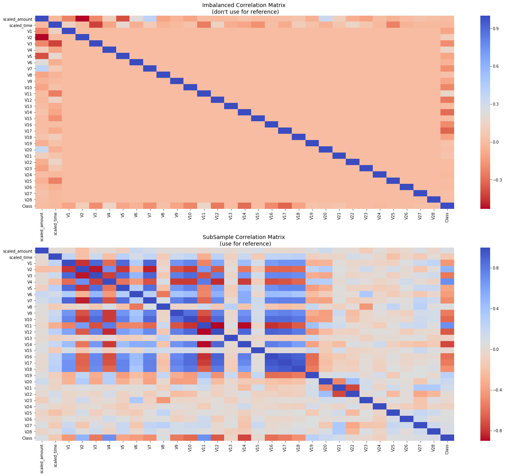
> Correlation Matrices

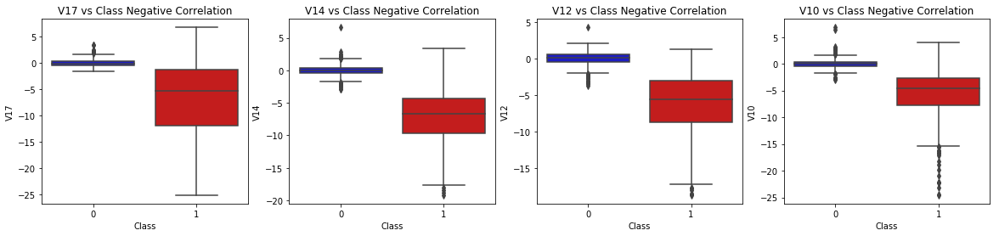
> Negative Correlations

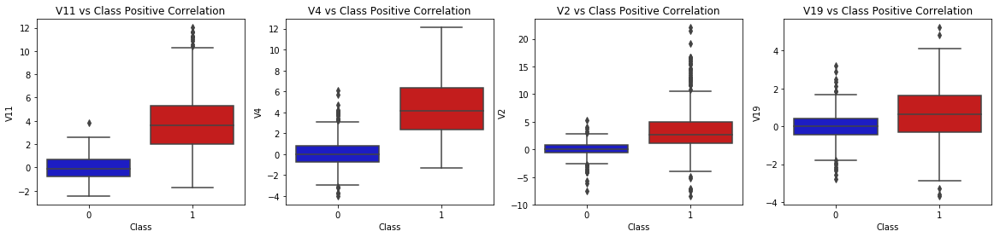
> Positive correlations

#### Visualisation Plots

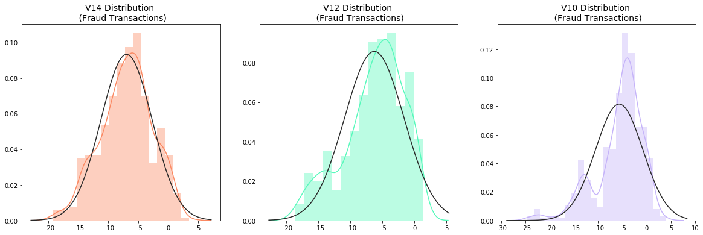
> Distribution Plots of Fraud Transactions

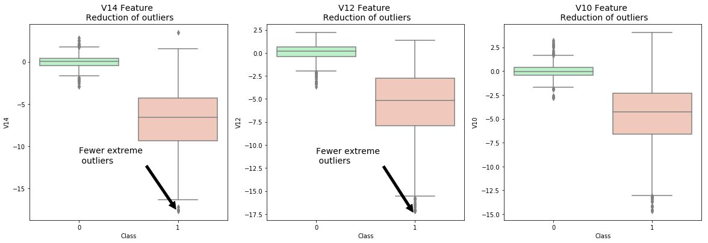
> Boxplots with outliers reduction.

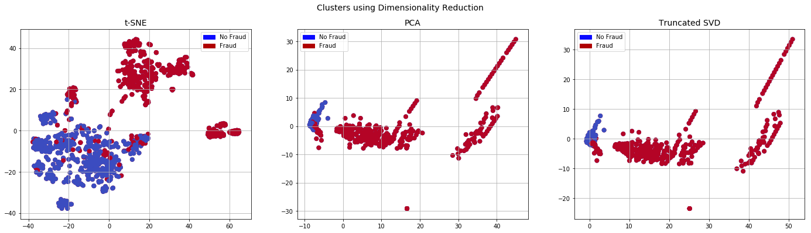
> Clusters using Dimensionality Reduction

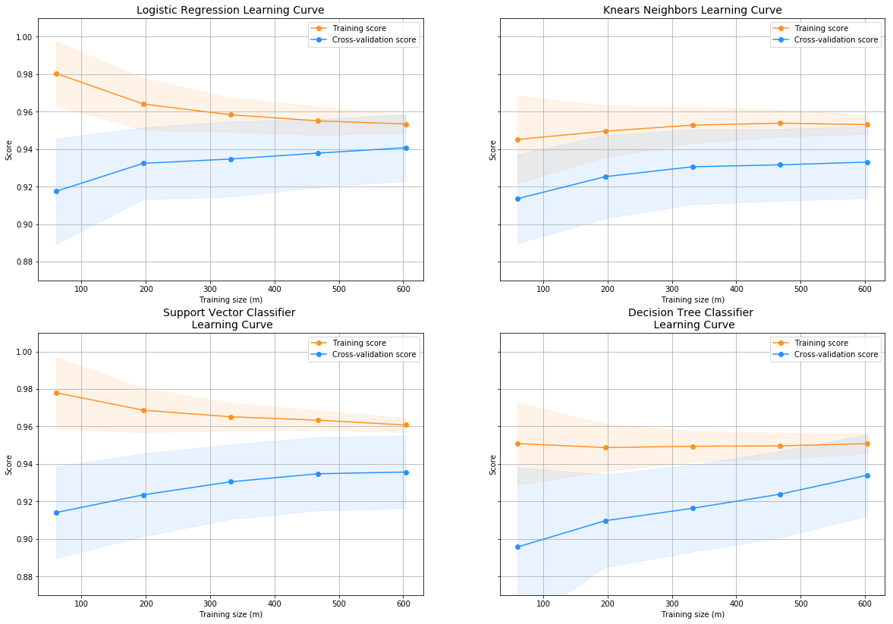
> Learning Curve of Classifiers

#### Final Results

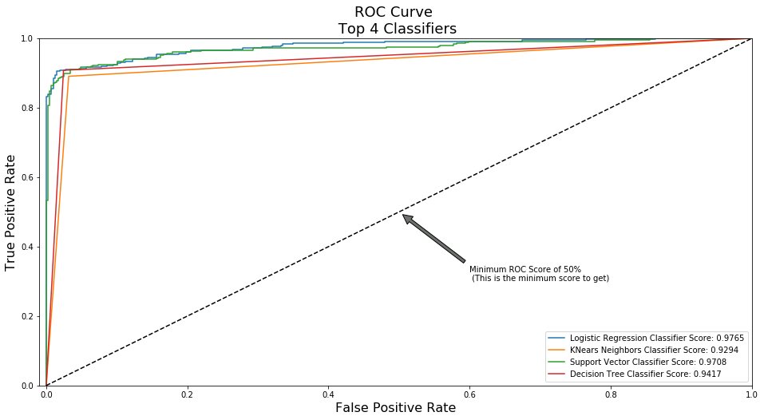
> Classifiers ROC Curve

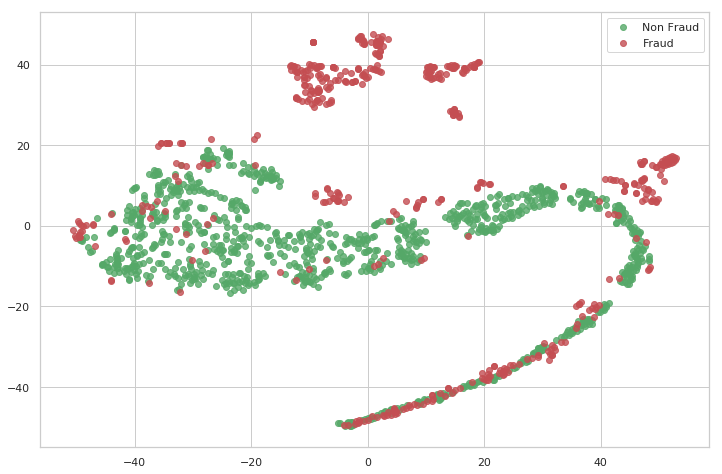
> Logistic Regression ROC Curve

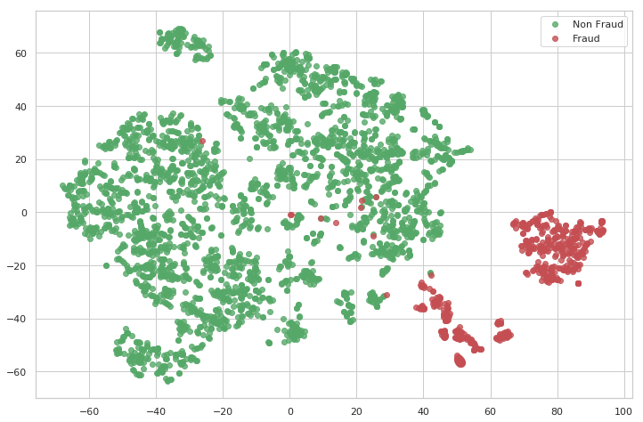
> tsne_plot of fraud and non-fraud transactions

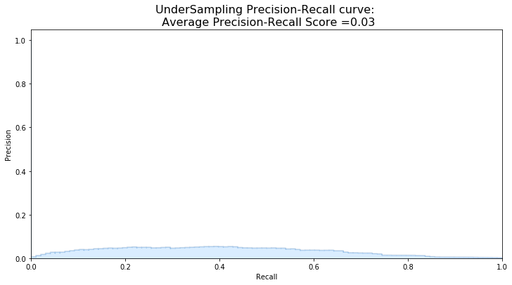
> Latent representations of fraud and non-fraud transactions

### For further information

Please review the narrative of our analysis in [our jupyter notebook](./credit-card-fraud-detection.ipynb)

For any additional questions, please contact **shaileshshettyd@gmail.com)

##### Repository Structure:

```
├── README.md                             <- The top-level README for reviewers of this project.
├── credit-card-fraud-detection.ipynb     <- narrative documentation of analysis in jupyter notebook
└── images                                <- both sourced externally and generated from code
```
